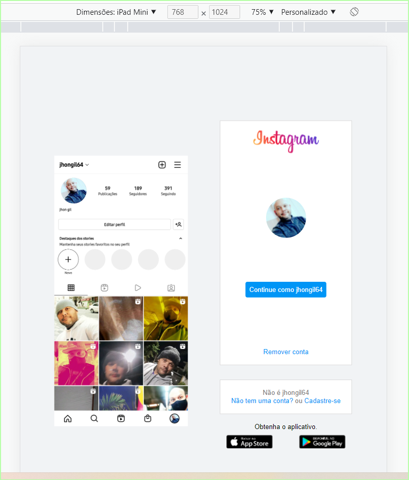

# Desafio DIO inicial do Instagram

* Nesse projeto você terá o desafio de reconstruir a página de login do Instagram. Para isso, é recomendado o uso de **CSS com Flexbox**, uma das abordagens de posicionamento de elementos mais utilizadas quando se trata de responsividade. Além disso, a expert disponibiliza todo o material necessário em seu **GitHub** para que você possa utilizá-lo como referência para a sua solução.

## Link:  https://jhonmanuelg.github.io/Desafio_DIO_inicial_do_Instagram/

 ### Medias queries

 *****
 * Vita, web

 

 ***
 * Vista, Table

 

 ****
 * vista, Mobile
 
 
